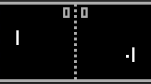

<!DOCTYPE html>
<html lang="en">
<head>
<link rel="icon" href="image/design.ico">
<title>Apex Riddles</title>
<meta name="google-site-verification" content="2xtauavm1RYCLmQMawnwFvqbxFF0lycd73fistyMujQ" />
<meta name="description" content="Apex Riddles is designed to be an engaging experience for all ages - whether you are young or old, come enjoy a few riddles with us!">

<meta charset="UTF-8">
<meta name="viewport" content="width=device-width, initial-scale=1">
<link rel="stylesheet" href="https://www.w3schools.com/w3css/4/w3.css">
<link rel="stylesheet" href="https://fonts.googleapis.com/css?family=Lato">
<link rel="stylesheet" href="https://cdnjs.cloudflare.com/ajax/libs/font-awesome/4.7.0/css/font-awesome.min.css">
<link rel="stylesheet" href="https://cdnjs.cloudflare.com/ajax/libs/font-awesome/4.7.0/css/font-awesome.min.css">

<body>
<!-- Page content -->

  <a href="index.html" id="home">Home&ensp;&nbsp;</a>
  <a href="contact.html" id="about">About&ensp;&nbsp;</a>
  <a href="levels.html" id="levels">Levels&ensp;&nbsp;</a>

  <!-- Automatic Slideshow Images -->
  

     

    

  

      
    

  

    
  

  <!-- The information -->
  

<h1 class="w3-wide"><b>♕ 𝒜𝓅𝑒𝓍 𝑅𝒾𝒹𝒹𝓁𝑒𝓈 ♕ </b></h1>

We love riddles! Can you make your way through these intriguing challenges?

    
Apex Riddles is designed to be a fun and engaging experience for individuals of all ages - whether you are young or old, we want you to experience the thrill and joy of riddles so that you can utilize your time to improve your skills! Numerous past participants have tried and recommended these riddles, due to their simplistic, yet challenging design. To maintain this website, we need your support. We work around the clock to help deliver smiles, and any donation or a simple "thank you" on our contact page is appreciated!
    

    

      

  

  <!-- challenges -->
  

    

      <h2 class="w3-wide w3-center">FACTS</h2>
      
<i>Interesting Facts You Probably Don't Know</i>
 
      

      

        

          
          

            
<b>First Game</b>

            
The First Game was Pong. It was invented in October 1958 by William Higinbotham.

            <button class="w3-button w3-black w3-margin-bottom".style.display='block'"><a href="https://en.wikipedia.org/wiki/Early_history_of_video_games" target="_blank">View More</button></a>
          

        

        

          
          

            
<b>First Virus</b>

            
The First Virus was Creeper. It was invented in the early 1970s by Bob Thomas.

            <button class="w3-button w3-black w3-margin-bottom".style.display='block'"><a href="https://en.wikipedia.org/wiki/Computer_virus" target="_blank">View More</button></a>
          

        

        

          
          

            
<b>First Computer Programmer</b>

            
The First Computer programmer was Ada Lovelace.

            <button class="w3-button w3-black w3-margin-bottom".style.display='block'"><a href="https://en.wikipedia.org/wiki/Ada_Lovelace" target="_blank">View More</button></a>
          

        

      

    

  

</body>
</html>
